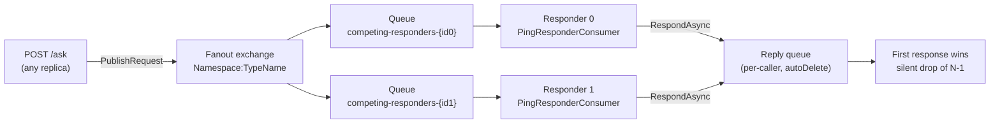

# BareWire.Samples.CompetingResponders

Demonstrates **publish-style request/response with competing responders and first-in-wins** semantics using BareWire's fanout exchange routing.

## What this sample shows

| Feature | Detail |
|---------|--------|
| ADR-001 Raw-first | System.Text.Json serializer, no envelope by default |
| ADR-002 Manual topology | Explicit fanout exchange and per-instance queue declarations |
| ADR-027 Publish-style request/response | `PublishRequest<PingRequest>()` routes to a per-type fanout exchange; all bound queues receive a copy |
| Competing responders | `WithReplicas(2)` starts two instances; each owns a **unique** queue bound to the same fanout exchange — broadcast, not load-balancing |
| First-in-wins | `IRequestClient<T>.GetResponseAsync` returns exactly one response; remaining N-1 are silently dropped |

## Architecture



## How to run

Run the full AppHost (starts RabbitMQ via Docker + all samples with replicas):

```bash
dotnet run --project samples/BareWire.Samples.AppHost
```

Or run a single instance directly (requires a local RabbitMQ broker):

```bash
dotnet run --project samples/BareWire.Samples.CompetingResponders
```

Then send a request:

```bash
curl -X POST "http://localhost:5121/ask?payload=hello"
# {"echo":"hello","responderId":"..."}
```

## Three caveats (m6)

**1. CorrelationId echo is automatic.**
`RespondAsync` routes the response back via the `ReplyTo` header and echoes the `CorrelationId` automatically. No manual correlation is required in the consumer.

**2. The fanout reply-queue is outside ADR-004 credit-based flow control.**
The caller-side reply queue uses autoAck (the framework's `RabbitMqRequestClient`). The credit-based backpressure of ADR-004 applies to the outbound publish side only, not to the reply-queue consumer path.

**3. First-in-wins drops N-1 RESPONSES, not N-1 EXECUTIONS.**
Every responder replica fully processes the request — side effects run N times. This sample's side effect is a `Debug` log entry, which is intentionally idempotent. Responders with non-idempotent side effects (database writes, external calls) will execute N times even though the caller receives only one response.

**4. Per-instance responder queues are `autoDelete:true`.**
Each replica declares its own queue with `autoDelete:true`. When a replica disconnects, the broker immediately reclaims the queue. There are no orphaned queues on long-lived brokers or after `dotnet run` restarts.
